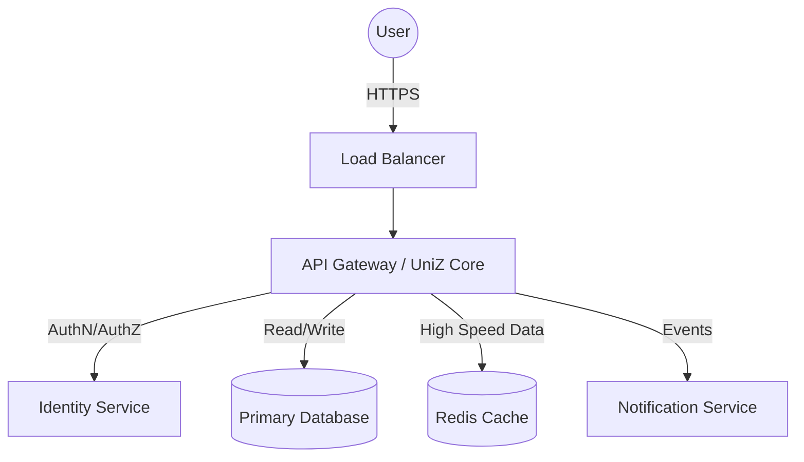
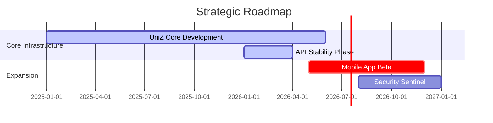

<!--
  UniZ Organization Profile
  Enterprise-Grade University Operating System
-->

# UniZ Organization

**The Operating System for Modern Universities**

UniZ provides a centralized, scalable, and intelligent Content Management System (CMS) designed to orchestrate university operations. From academic resource distribution to campus administration, we deliver enterprise-grade reliability and seamless integration.

---

## Mission

To modernize campus management through a unified digital infrastructure, prioritizing **efficiency**, **transparency**, and **maintainability**.

## System Architecture

Our platform is built on a microservices-inspired architecture to ensure high availability and separation of concerns.

## Technology Stack

We leverage industry-standard technologies to build robust and scalable solutions.

- **Frontend**: React, Next.js, TypeScript
- **Backend**: Node.js, Express, Prisma
- **Infrastructure**: Docker, Kubernetes, AWS
- **Data Persistence**: PostgreSQL, MongoDB, Redis

## Roadmap & Initiatives

## Contributing

We welcome professional contributions. Please refer to our [Contributing Guidelines](https://github.com/uniz-rguktong/.github/blob/main/CONTRIBUTING.md) for detailed workflows.

1.  **Fork** the repository.
2.  **Create** a feature branch.
3.  **Submit** a Pull Request with comprehensive tests.

## Security

Security is a foundational pillar of UniZ. Vulnerabilities should be reported in accordance with our [Security Policy](https://github.com/uniz-rguktong/.github/blob/main/SECURITY.md).

---

  

    <a href="https://github.com/uniz-rguktong">Home</a> •
    <a href="https://github.com/uniz-rguktong/uniZ/issues">Issues</a> •
    <a href="mailto:contact@uniz.org">Contact</a>
  

  
© 2026 UniZ Organization

